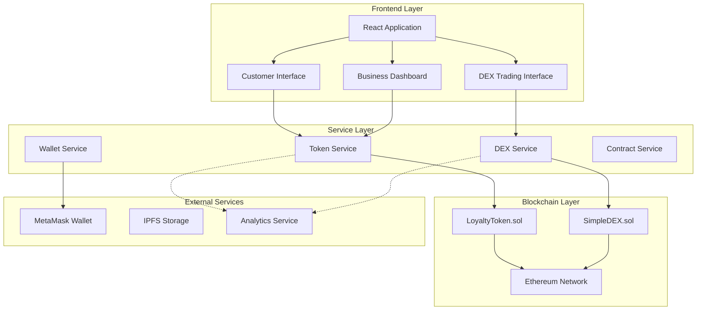
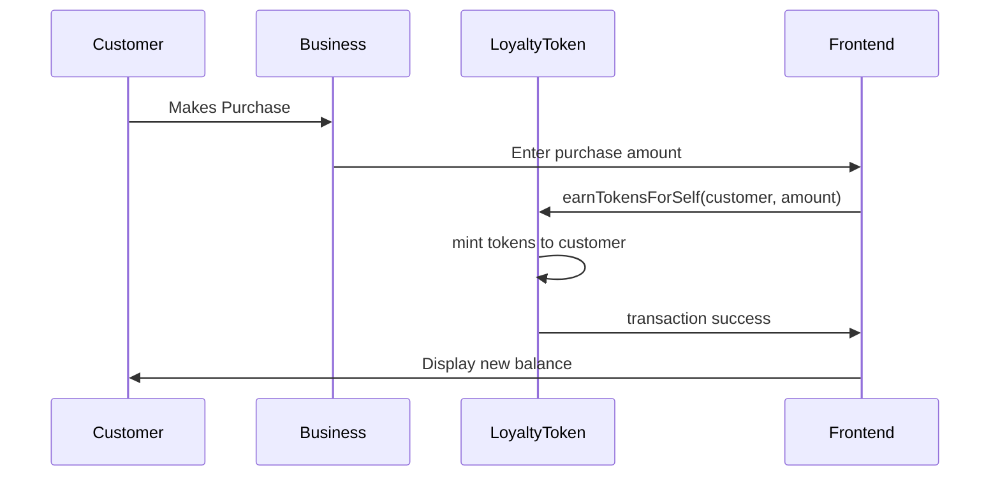
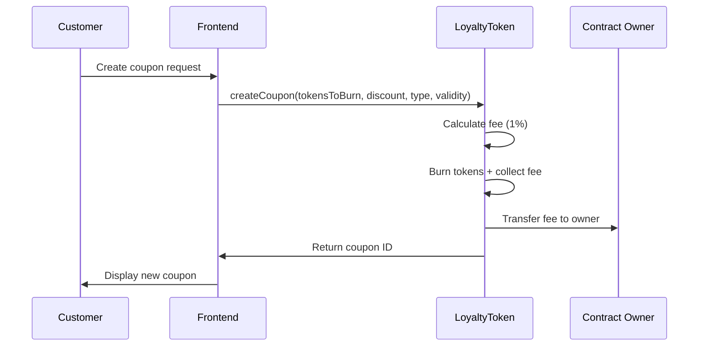
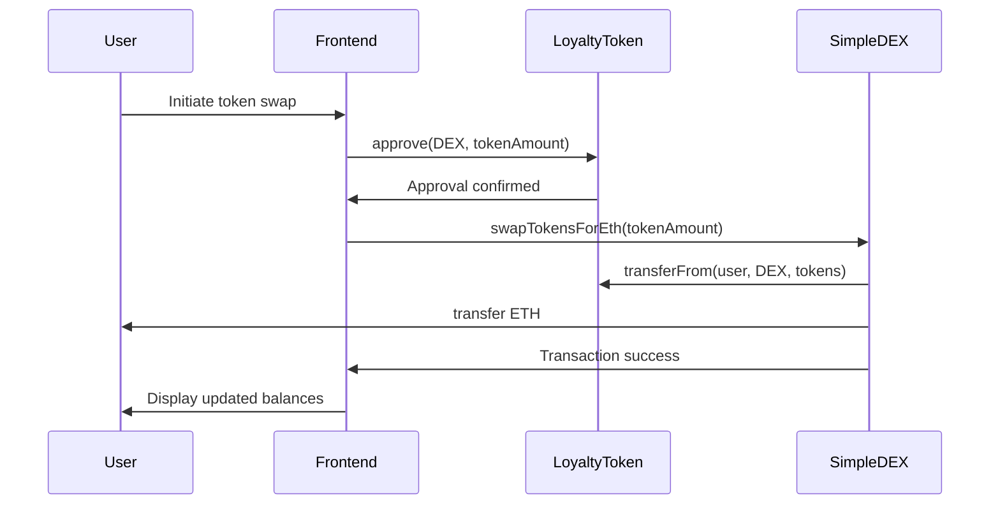

# 🏗️ LoyalLoop System Architecture

## Overview

LoyalLoop is a decentralized loyalty ecosystem built on Ethereum, featuring a three-tier architecture that provides scalability, security, and user-friendly interfaces for both customers and businesses.

## Architecture Diagram



## Layer Details

### 1. Frontend Layer (React Application)

#### Customer Interface
- **Purpose**: Consumer-facing loyalty program management
- **Features**:
  - Token earning through purchases
  - Coupon creation and management
  - Token trading on integrated DEX
  - Transaction history and analytics

#### Business Dashboard
- **Purpose**: Business owner management and analytics
- **Features**:
  - Real-time token metrics
  - Revenue tracking and reporting
  - DEX liquidity management
  - Customer analytics

#### DEX Trading Interface
- **Purpose**: Decentralized token exchange
- **Features**:
  - ETH ↔ LOYAL token swapping
  - Liquidity provision
  - Real-time pricing and charts
  - Slippage protection

### 2. Service Layer (JavaScript Services)

#### Token Service (`src/services/token.js`)
- **Responsibilities**:
  - Token balance queries
  - Coupon creation and management
  - Token approval and allowance management
  - Transaction submission and monitoring

#### DEX Service (`src/services/dex.js`)
- **Responsibilities**:
  - Token swapping operations
  - Liquidity management
  - Price calculations and slippage
  - DEX status monitoring

#### Wallet Service (`src/services/wallet.js`)
- **Responsibilities**:
  - MetaMask integration
  - Network switching and validation
  - Account management
  - Transaction signing

#### Contract Service (`src/services/contractVerification.js`)
- **Responsibilities**:
  - Contract deployment verification
  - ABI management
  - Network configuration
  - Error handling and diagnostics

### 3. Blockchain Layer (Smart Contracts)

#### LoyaltyToken.sol
```solidity
contract LoyaltyToken is ERC20, Ownable, ReentrancyGuard {
    // Core ERC-20 functionality
    // Coupon creation and management
    // Deflationary token burning
    // Platform fee collection
}
```

**Key Features**:
- ERC-20 standard compliance
- Deflationary tokenomics
- Coupon system with NFT-like properties
- Owner-controlled emission
- 1% platform fee on coupon creation

#### SimpleDEX.sol
```solidity
contract SimpleDEX is Ownable, ReentrancyGuard {
    // Automated Market Maker (AMM)
    // Liquidity pool management
    // Fee collection and distribution
    // Owner controls and emergency functions
}
```

**Key Features**:
- Constant product AMM (x * y = k)
- ETH/LOYAL trading pair
- 1% trading fee
- Liquidity provider rewards
- Owner-controlled parameters

## Data Flow Diagrams

### Customer Token Earning Flow


### Coupon Creation Flow


### DEX Trading Flow


## Security Architecture

### Smart Contract Security

#### 1. Access Control
- **Ownable Pattern**: Critical functions restricted to contract owner
- **Role-based Access**: Different permission levels for different operations
- **Multi-signature**: Consider implementing for high-value operations

#### 2. Reentrancy Protection
- **ReentrancyGuard**: Applied to all state-changing functions
- **Checks-Effects-Interactions**: Pattern followed in all functions
- **External Call Safety**: Limited and controlled external interactions

#### 3. Input Validation
- **Parameter Validation**: All inputs validated at contract level
- **Overflow Protection**: Solidity 0.8+ automatic overflow protection
- **Range Checks**: Appropriate bounds checking for all numerical inputs

#### 4. Economic Security
- **Fee Limits**: Maximum fee percentages to prevent exploitation
- **Minimum Values**: Prevent dust transactions and spam
- **Slippage Protection**: DEX operations include slippage limits

### Frontend Security

#### 1. Wallet Integration
- **Secure Communication**: Direct browser-wallet communication
- **Permission Model**: Request minimal necessary permissions
- **Session Management**: Secure handling of wallet connections

#### 2. Transaction Safety
- **Pre-transaction Validation**: Check balances and allowances
- **Gas Estimation**: Prevent failed transactions
- **Transaction Monitoring**: Track status and handle failures

#### 3. Data Validation
- **Input Sanitization**: All user inputs validated
- **Type Safety**: TypeScript for enhanced type safety
- **Error Boundaries**: React error boundaries for graceful failures

## Scalability Considerations

### Current Limitations
- **Ethereum Gas Costs**: High transaction fees during network congestion
- **Single Token Pair**: Only ETH/LOYAL supported currently
- **Centralized Components**: Some admin functions require owner intervention

### Scaling Solutions

#### Short-term (1-3 months)
- **Gas Optimization**: Optimize contract functions for lower gas usage
- **Batch Operations**: Implement batch processing for multiple operations
- **Layer 2 Integration**: Prepare for Polygon or Arbitrum deployment

#### Medium-term (3-6 months)
- **Multi-token Support**: Extend DEX to support multiple trading pairs
- **Advanced AMM**: Implement concentrated liquidity or stable swap curves
- **Governance Token**: Introduce DAO governance for decentralized control

#### Long-term (6+ months)
- **Cross-chain Support**: Bridge to multiple blockchain networks
- **Advanced Features**: Yield farming, staking, and additional DeFi primitives
- **Mobile Application**: Native mobile app for improved user experience

## Performance Optimization

### Frontend Optimization

#### 1. Code Splitting
- **Lazy Loading**: Load components only when needed
- **Route-based Splitting**: Split bundles by application routes
- **Component-level Splitting**: Split heavy components separately

#### 2. Caching Strategy
- **Browser Cache**: Utilize browser caching for static assets
- **Service Worker**: Implement service worker for offline capability
- **State Management**: Efficient React state management

#### 3. Network Optimization
- **API Batching**: Batch multiple blockchain calls
- **Intelligent Polling**: Reduce unnecessary network requests
- **WebSocket Integration**: Real-time updates where appropriate

### Blockchain Optimization

#### 1. Gas Efficiency
- **Function Optimization**: Minimize computational complexity
- **Storage Patterns**: Efficient storage layout and access patterns
- **Event Emission**: Use events for off-chain data indexing

#### 2. Transaction Management
- **Nonce Management**: Proper transaction ordering
- **Gas Price Optimization**: Dynamic gas price adjustment
- **Transaction Pooling**: Batch multiple operations when possible

## Monitoring and Analytics

### System Monitoring

#### 1. Contract Monitoring
- **Event Listening**: Monitor all contract events in real-time
- **State Tracking**: Track key metrics (supply, liquidity, fees)
- **Error Detection**: Automated error detection and alerting

#### 2. Performance Monitoring
- **Transaction Analytics**: Track gas usage and transaction success rates
- **User Behavior**: Monitor user interaction patterns
- **System Health**: Overall system health dashboards

### Business Intelligence

#### 1. Token Economics
- **Supply Metrics**: Track total supply, burning, and emission
- **Fee Analysis**: Revenue tracking from platform fees
- **Liquidity Metrics**: DEX liquidity and trading volume

#### 2. User Analytics
- **Customer Behavior**: Token earning and spending patterns
- **Business Performance**: Track business adoption and usage
- **Market Analysis**: Trading patterns and price discovery

## Deployment Architecture

### Development Environment
```
Hardhat Network (localhost:8545)
├── LoyaltyToken Contract
├── SimpleDEX Contract
├── Test Accounts (10 funded accounts)
└── Development Tools (console, debugger)
```

### Staging Environment
```
Testnet (Goerli/Sepolia)
├── Deployed Contracts
├── Test Token Faucet
├── Monitoring Dashboard
└── Integration Testing
```

### Production Environment
```
Ethereum Mainnet
├── Audited Contracts
├── Multi-signature Wallet
├── Monitoring & Alerting
├── Backup & Recovery
└── Performance Monitoring
```

## Technology Stack

### Frontend Stack
- **React 18**: Modern React with hooks and functional components
- **Ethers.js 6**: Ethereum interaction library
- **CSS3**: Custom styling with responsive design
- **Web3Modal**: Wallet connection abstraction

### Backend Stack
- **Solidity 0.8.24**: Smart contract development
- **Hardhat**: Development framework and testing
- **OpenZeppelin**: Security-audited contract libraries
- **Node.js**: Development tooling and scripts

### Development Tools
- **Hardhat Network**: Local blockchain for development
- **Hardhat Console**: Interactive contract debugging
- **Gas Reporter**: Gas usage optimization
- **Solhint**: Solidity code linting

### Deployment Tools
- **Hardhat Deploy**: Automated deployment scripts
- **Environment Management**: Multi-network configuration
- **Verification Tools**: Contract verification utilities

## Future Architecture Evolution

### Phase 1: Enhanced Features (Q1 2025)
- Multi-business support
- Advanced analytics dashboard
- Mobile-responsive improvements

### Phase 2: Scalability (Q2 2025)
- Layer 2 deployment
- Cross-chain bridge implementation
- Advanced DeFi features

### Phase 3: Ecosystem (Q3-Q4 2025)
- Partner integrations
- Third-party developer APIs
- Governance and DAO implementation

---

This architecture provides a solid foundation for a scalable, secure, and user-friendly decentralized loyalty ecosystem while maintaining flexibility for future enhancements and integrations.
